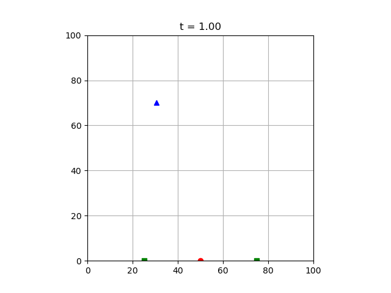

# Optimal Missile Evader Demonstration

This program demonstrates an aircraft being attacked with unguided missiles. A number of optimal aircraft controllers are implemented, which try to evade missiles and reach a target at the same time.

Physics of the model is very simple. All objects are massless points. Aerodynamics isn't taken into account. Acceleration and maximum speed of the aircraft are limited. Missile speed is fixed.

The program performs modeling displaying all objects as animated markers in Matplotlib axes.

The goal of this program is to demonstrate application of optimization procedures, optimal control and Python programming.

# Requirements

* Python 3.8.5
* SciPy 1.3.3
* NumPy 1.17.4
* Matplotlib 3.1.2

The versions listed are just the tested ones. Some older versions will surely work.

# How To Run

Put the `evader` directory somewhere in the Python module path.

Then you may run a couple of examples:

1. Fuel-economizing aircraft controller demonstration, run `python3 -m evader --objects evader.examples.minfuel`.
2. Minimum distance maximizing aircraft controller demonstration, run `python3 -m evader --objects evader.examples.maxmindist`.
3. Next distance maximizing aircraft controller demonstration, run `python3 -m evader --objects evader.examples.maxnextdist`.

# Keyboard Shortcuts

Press \<Esc\> to interrupt the modeling, \<Space\> to pause/unpause. Also, usual Matplotlib shortcuts should work (for example, hit \<Q\> to close the figure window).

# License

The project is licensed under the MIT license.

# Author

Kirill Pushkaryov <kpushkaryov@gmail.com>